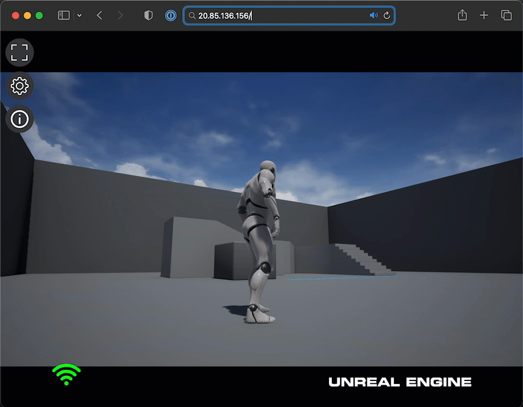
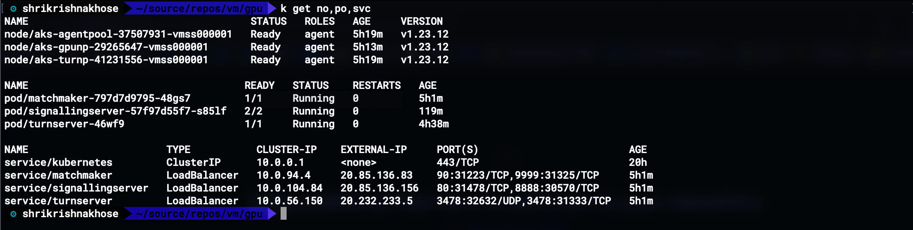
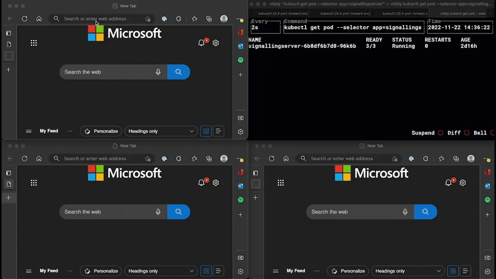

# The Unreal Pixel Streaming On Azure Kubernetes Service!
Referenece Repo to deploy Unreal Pixel Streaming on AKS

## Build Unreal Engine App image . Copy the Dockerfile to the root of the Unreal Engine App

***NOTE*** 
> YOU MUST JOIN THE EPIC GAMES GitHub ORG to access the base container image:
https://www.unrealengine.com/en-US/ue-on-github
>
> Then you must Log in to GitHub Container Registry (GHCR) with a Pat Token:
https://docs.github.com/en/packages/working-with-a-github-packages-registry/working-with-the-container-registry#authenticating-to-the-container-registry
>
> Finally, create a Classic PAT token and grant `read:package` scope

```bash
# Set ENV VAR
export CR_PAT="your-read-only-token-for-packages"
export USERNAME="your-git-hub-user-name"
# Log into GHCR to build this image in an interactive login shell

echo $CR_PAT | docker login ghcr.io -u $USERNAME --password-stdin
```



## Provision AKS Service on Azure

In this initial run of the 

```infrastructure/azure-cli/ClusterCreate.sh```

**NOTE**: 
> Ensure you set/change the variables `RG_NAME`, `CLUSTER_NAME`, `LOCATION` to suit your needs

```bash
#! /bin/bash

export RG_NAME="pixel_group"
export CLUSTER_NAME="urpixelstream"
export LOCATION="eastus"

# Create Resource Group
az group create \
    --name $RG_NAME \
    --location $LOCATION

# Create Azure Container Registry
az acr create \
    --name $CLUSTER_NAME \
    --resource-group $RG_NAME \
    --location $LOCATION \
    --sku Standard

# Create AKS Cluster
az aks create \
    -g $RG_NAME \
    -n $CLUSTER_NAME \
    --location $LOCATION \
    --enable-managed-identity \
    --node-count 1 \
    --enable-addons monitoring \
    --attach-acr $CLUSTER_NAME \
    --enable-msi-auth-for-monitoring  \
    --generate-ssh-keys
```
### Add a GPU nodepool
```infrastructure/azure-cli/Nodepools.sh```
```bash
# Add a GPU sku nodepool
# Note: Taint the nodepool so that  

az aks nodepool add \
    --resource-group $RG_NAME \
    --cluster-name $CLUSTER_NAME \
    --name gpunp \
    --node-count 1 \
    --node-osdisk-size 250 \
    --mode User \
    --node-vm-size $GPU_NP_SKU \
    --aks-custom-headers UseGPUDedicatedVHD=true \
    --node-taints sku=gpu:NoSchedule
```    

### Add a nodepool for TURN
```infrastructure/azure-cli/Nodepools.sh```
```bash
    az aks nodepool add \
    --resource-group pixel_group \
    --cluster-name uepixelstrm \
    --name turnp \
    --node-count 1 \
    --node-vm-size Standard_F8s_v2 \
    --node-taints sku=turn:NoSchedule \
    --node-osdisk-size 250 \
    --mode User \
    --enable-node-public-ip
```

### Get AKS Credentials to deploy services to AKS
```bash
az aks get-credentials -n $CLUSTER_NAME -g $RG_NAME
# Note: Will need to add in kubelogin instructions
```

## Containerize and Deploy Game Server Components

### Build and Push Matchmaker,Signalling,TURN and Game Images

We will need to build and push the Game Server Components to our Azure Container Registry (ACR) for use in our AKS Cluster.

``` bash
cd game-server-components
./docker-build.sh
```


### Deploy Redis server to store realtime count of current connected players

Redis will be a dependency for the game server components to store info about currently connected  players

```bash
kubectl apply -f manifests/aks-deploy-redis.yaml
```

### Deploy Pixel Streaming Services on AKS
```bash 
    kubectl apply -f manifests/aks-deploy-game-server-components.yaml
```


# Autoscale Deployment of the Unreal Pixel Streaming On Azure Kubernetes Service!

This is reference implementation for autoscaling of signalling servers based on number of connected players.

### Deploy Autoscaled Pixel Streaming Services on AKS
```bash
 kubectl apply -f manifests/aks-deploy-game-server-components-with-autoscale.yaml
 ```



## Legal
© 2004-2022, Epic Games, Inc. Unreal and its logo are Epic’s trademarks or registered trademarks in the US and elsewhere. 
